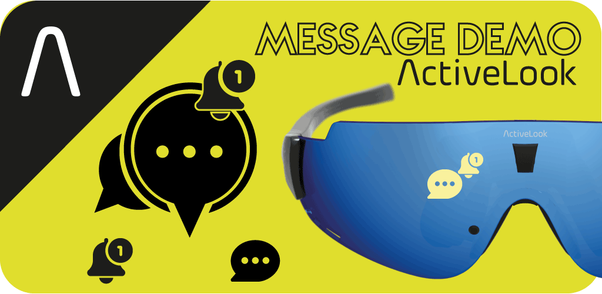

# ActiveLook® MESSAGE

Description : Read all your notifications in your in your Augmented Reality ActiveLook® smart glasses

<p align="center"> 
The application can be found on GooglePlay :
    https://play.google.com/store/apps/details?id=com.activelook.messages

    
### License

```
Licensed under the Apache License, Version 2.0 (the “License”);
you may not use this file except in compliance with the License.
You may obtain a copy of the License at
    http://www.apache.org/licenses/LICENSE-2.0
Unless required by applicable law or agreed to in writing, software
distributed under the License is distributed on an “AS IS” BASIS,
WITHOUT WARRANTIES OR CONDITIONS OF ANY KIND, either express or implied.
See the License for the specific language governing permissions and
limitations under the License.
```

### Requirements

You will need the following:
- A pair of ActiveLook® glasses
- Android Studio
- An android device with BLE

Known supported Devices :
- ENGO® : Cycling & Running action glasses (http://engoeyewear.com/)
- Julbo EVAD® : Premium smart glasses providing live data for intense sporting experiences (https://www.julbo.com/en_gb/evad-1)
- Cosmo Connected : GPS & cycling (https://cosmoconnected.com/fr/produits-velo-trottinette/cosmo-vision)


### Main files to modify

The name of the app is defined in the strings.xml file.

* app\src\main\res\layout\content_scrolling.xml
* app\src\main\res\values\strings.xml
* app\src\main\java\com\activelook\messages\MainActivity.java

In order to get the best performances, the ActiveLookSDK directory should be the latest release from : https://github.com/ActiveLook/android-sdk

### detailled description of this Android application

This messages or notifications demo application will display in your ActiveLook® glasses all your notifications from any application: SMS, WeChat, Snapchat, LinkedIn, teams, Twitter, Facebook, OutLook, clock, calendar,…

This application resend all the messages to your ActiveLook® A/R glasses. It also shows you the logo of the application on the left, then the sender, then his/her message (or only the email title).
